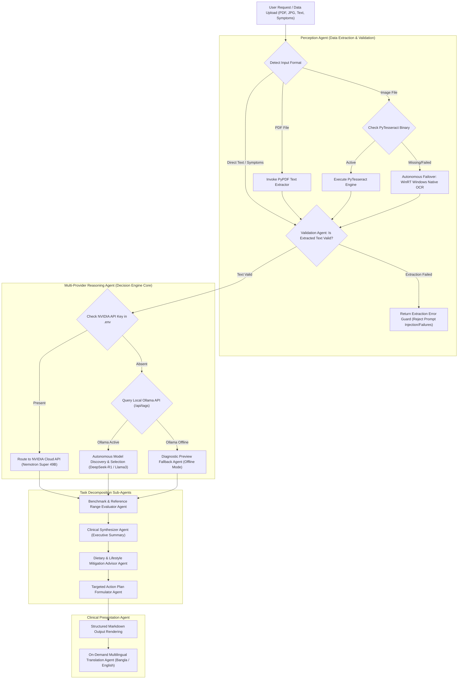

# Agentic AI Methodology & System Architecture

This document details the **Agentic AI Architecture** governing the **Medical Report Analyzer** application, highlighting autonomous decision nodes, tool selection mechanisms, multi-LLM orchestration, and task decomposition sub-agents.

---

## 🤖 Visual Agentic AI Architecture Diagram

---

## 📊 Agentic Decision & Control Flowchart (Mermaid)

---

## 🔬 Core Agentic AI Components & Behaviors

### 1. Perception & Tool Selection Agent
* **Autonomous File Inspection**: Inspects uploaded document structures to choose native stream parsers vs optical character recognition.
* **Self-Healing OCR Failover**: When `PyTesseract` binaries are missing or fail, the agent autonomously fallback-reroutes to `Windows WinRT OCR` via PowerShell bridge without throwing unhandled crashes or prompting the user.
* **Extraction Guard Agent**: Inspects raw OCR text for errors or empty strings to prevent passing unreadable tool outputs into the LLM context.

### 2. Multi-Provider Reasoning Agent
* **Infrastructure Discovery**: Autonomously inspects available compute environments (Cloud NIM API vs Local Ollama server).
* **Dynamic Model Selection**: Queries local model registries (`/api/tags`) and picks the best available model (`deepseek-r1:14b` $\rightarrow$ `deepseek-r1:1.5b` $\rightarrow$ `llama3.2`).
* **Offline Resiliency**: Automatically switches to Diagnostic Fallback Agent if network/compute services are offline.

### 3. Task Decomposition Sub-Agents
The reasoning engine delegates complex clinical analysis into specialized sub-agent tasks:
1. **Benchmark & Reference Range Evaluator Agent**: Compares numerical test results against clinical reference benchmarks (e.g. Normal `<5.7%`, Prediabetes `5.7%–6.4%`, Diabetes `≥6.5%`).
2. **Clinical Synthesizer Agent**: Generates a crisp, 1-2 sentence executive summary of overall patient health.
3. **Dietary & Lifestyle Mitigation Advisor Agent**: Identifies specific high-glycemic or refined food groups to reduce.
4. **Targeted Action Plan Formulator Agent**: Outlines step-by-step exercise, hydration, and follow-up medical consultation schedules.
